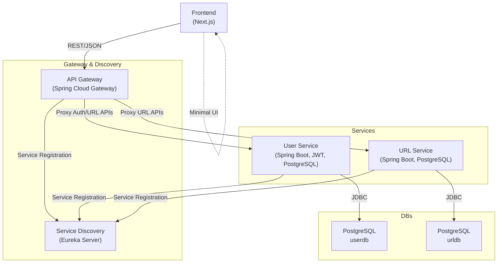

# 🏗️ Backend Architecture

This document provides a comprehensive overview of the backend architecture for the URL Shortener Microservices project. It details the responsibilities, technologies, and interactions of each service.

---

## 📊 System Architecture Diagram

---

## 🧩 Service Descriptions

### 1. **API Gateway (Spring Cloud Gateway)**
- **Role:** Central entry point for all client requests. Handles routing, CORS, authentication filtering, and forwards requests to the appropriate backend service.
- **Key Features:**
  - JWT authentication filter for protected routes.
  - CORS configuration for frontend integration.
  - Service discovery integration (Eureka).
- **Tech:** Spring Cloud Gateway, Java 21, Docker.

### 2. **Service Discovery (Eureka Server)**
- **Role:** Registry for all backend services, enabling dynamic discovery and load balancing.
- **Key Features:**
  - All services register themselves on startup.
  - Gateway uses Eureka to route requests to healthy instances.
- **Tech:** Spring Cloud Netflix Eureka, Java 21, Docker.

### 3. **User Service**
- **Role:** Handles user registration, authentication, and JWT issuance.
- **Key Features:**
  - Secure password storage (BCrypt).
  - JWT-based authentication (configurable via env vars).
  - User CRUD and login endpoints.
  - Connects to its own PostgreSQL database (`userdb`).
- **Tech:** Spring Boot 3.x, Spring Security, PostgreSQL, Docker.

### 4. **URL Service**
- **Role:** Manages URL shortening, redirection, and analytics.
- **Key Features:**
  - Generates unique short URLs for authenticated users.
  - Stores mappings in its own PostgreSQL database (`urldb`).
  - Handles redirection and visit tracking.
- **Tech:** Spring Boot 3.x, PostgreSQL, Docker.

### 5. **PostgreSQL Databases**
- **Role:** Persistent storage for user and URL data.
- **Key Features:**
  - Two separate databases: `userdb` (for User Service) and `urldb` (for URL Service).
  - Initialized via Docker Compose and `init-multi-db.sh`.
- **Tech:** PostgreSQL 15, Docker.

---

## 🌐 Frontend Note

The frontend (Next.js) is intentionally minimalistic, as the primary focus of this project is to learn and demonstrate Spring Boot microservices architecture and backend best practices.

---

## 📂 Directory Structure

- `api-gateway/` — API Gateway service
- `service-discovery/` — Eureka server
- `user-service/` — User management/authentication
- `url-service/` — URL shortening logic
- `url-shortener-frontend/` — Minimal Next.js frontend
- `docker-compose.yml` — Local development orchestration
- `docker-compose-prod.yml` — Production orchestration (Docker Hub images)

---

For more details, see the main [README.md](./README.md). 